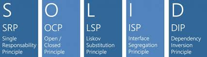

# SOLID-principles

> APIrest com typescript baseado nos princípios do SOLID e packege-by-feature 
           
                                     


*No SOLID*, cada letra do nome significa um de seus princípios. Assim, temos no total 5 para serem seguidos.

*S-ingle responsibility principle* - Cada arquivo e classe da sua aplicação deve ter apenas uma única responsabilidade.

O-pen closed principle - Uma classe deve ser aberta para extensões, porém, não para modificações.

L-iskov substitution principle - As classes derivadas devem ser substituíveis por suas classes bases. Este princípio está bem ligado ao anterior, e nos alerta sobre o uso de herança.

I-nterface segregation principle - O principio prega que uma interface não deve forçar uma classe a implementar coisas que ela não irá utilizar. Isso facilita a manutenção.

D-ependency inversion principle - Básicamente, utilizar níveis de abstração corretos. Classes não devem depender de implementações e sim de interfaces. 


## Instalação

Baixe ou clone o repositório para ter acesso ao código e desenvolver.

no seu editor de código preferencial, abra o terminal e digite:

### NPM

```sh
npm install
```

### yarn

```sh
yarn install
```

essa ação irá instalar os seguintes módulos:

venom-bot": "^1.1.4"

## Configuração para Desenvolvimento

Depois de instalado os módulos, execute o script criado para inicializar o projeto: 

### NPM

```sh
npm dev
```
### yarn

```sh
yarn dev
```

Isso irá executar a aplicação e gerar, no seu terminal, um QR code para autenticação do whatsapp web. Com seu aparelho em mãos, leia o código.

 Após isso, sua instância será salva e toda vez que iniciar a aplicação não precisará ler o Qr code novamente.

Depois de autenticado e tudo funcionando, você terá acesso a muitos dados sobre o usuário e a mensagem recebida pelo bot. Um exemplo:

 

obs.: Deixei um console log comentado no index, caso queira vizualizar um exemplo parecido no seu terminal.

com esses dados recebidos, existem infinitas possibilidades de coisas que podemos fazer.

qualquer duvida ou sugestão:


Matheus de Oliveira Mendonça – [@MathSilms](https://www.linkedin.com/in/mathsilms/) – Mateheusoliver@gmail.com